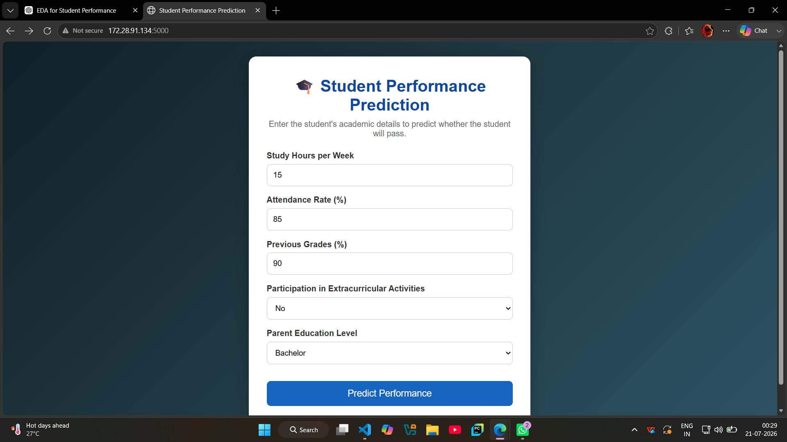
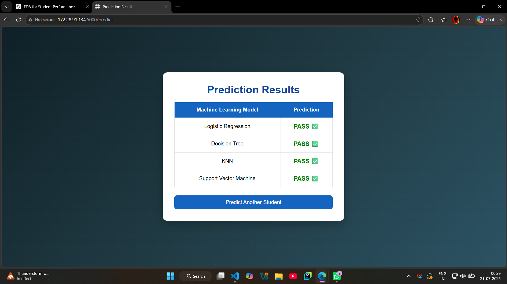

# MukulKumar_PBEL_3_0
# 🎓 Student Performance Prediction using Machine Learning

## 📌 Project Overview

Student Performance Prediction is a Machine Learning web application that predicts whether a student is likely to pass or fail based on academic and personal factors.

The project compares the predictions of five different machine learning algorithms through a Flask-based web interface.

---

## 🚀 Features

- Predict student performance
- Compare results from multiple ML algorithms
- Clean and responsive user interface
- Flask-based web application
- Easy to use prediction form

---

## 📊 Dataset Features

The model uses the following input features:

- Study Hours per Week
- Attendance Rate
- Previous Grades
- Participation in Extracurricular Activities
- Parent Education Level

Target Variable

- Passed (0 = Fail, 1 = Pass)

---

## 🤖 Machine Learning Models

- Logistic Regression
- Decision Tree
- Random Forest
- K-Nearest Neighbors (KNN)
- Support Vector Machine (SVM)

---

## 🛠 Technologies Used

### Programming Language

- Python

### Libraries

- Flask
- NumPy
- Pandas
- Scikit-learn
- Joblib

### Frontend

- HTML
- CSS

---

## 📂 Project Structure

```text
Student_Performance_Prediction/

│── app.py
│── requirements.txt
│── Procfile

│── Model/
│     logistic.pkl
│     decision_tree.pkl
│     random_forest.pkl
│     knn.pkl
│     svm.pkl
│     scaler.pkl

│── templates/
│     index.html
│     result.html

│── static/
│     style.css

│── Dataset/

│── README.md
```

## 📷 Screenshots

### Home Page



### Prediction Result



---

## 🌐 Live Demo

Render Deployment
https://mukulkumar-pbel-3-0.onrender.com

---

## 👨‍💻 Author

Mukul Kumar
B.Tech CSE (AI & ML)
ABES Engineering College

GitHub:
https://github.com/mukulkr30

---

## 📜 License

This project is developed for educational purposes as part of the IBM Project Based Experiential Learning (PBEL) Program.
